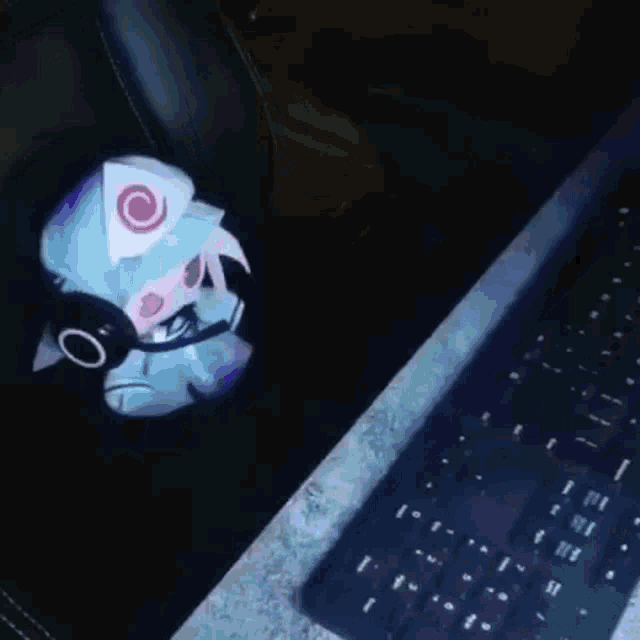

<h2 align="center">✨ welcome into my lair ✨</h2>

    

    

        <h3 align="center">📈 some random stats (so cool) 📈</h3>
        

            
        

    

    

        <h3 align="center">🎂 me cooking code (fr) 🎂</h3>
        

            
        

    

